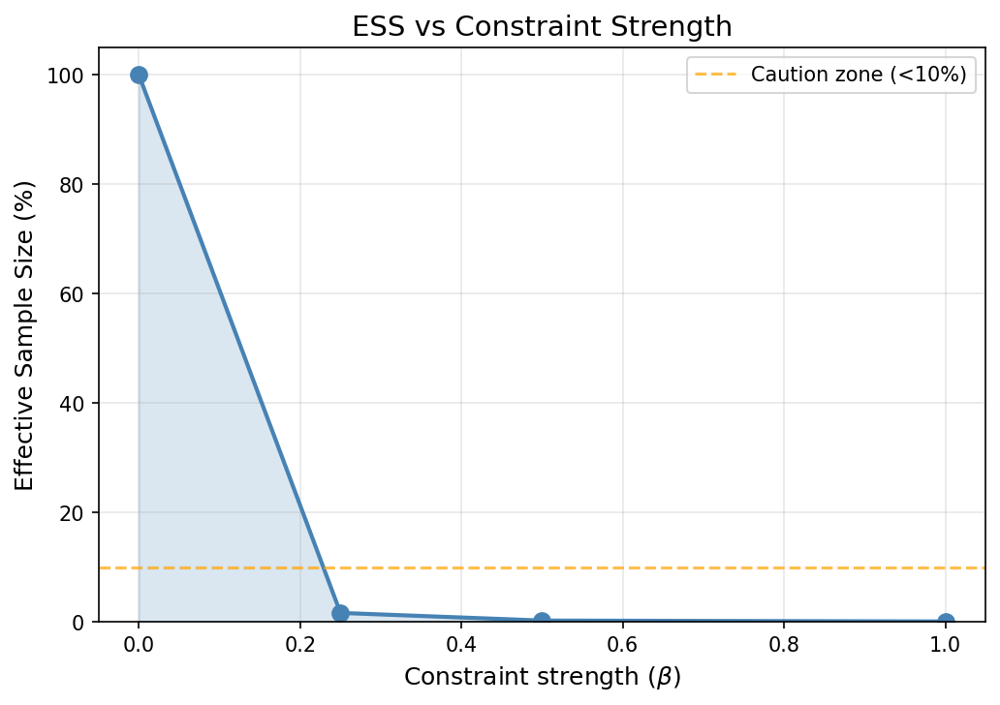
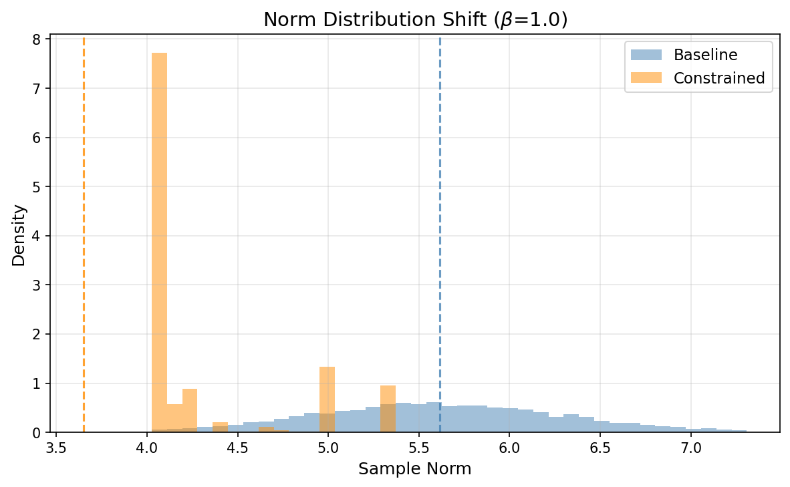
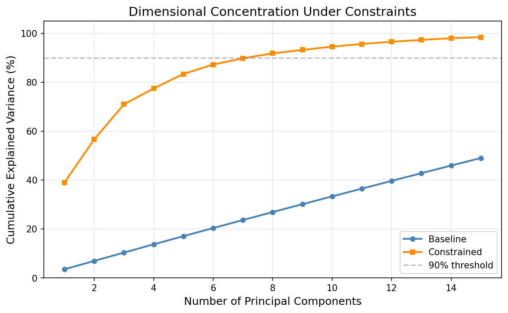
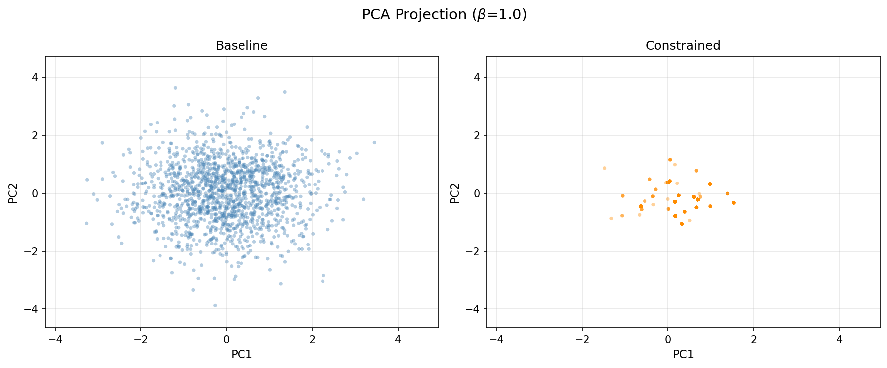
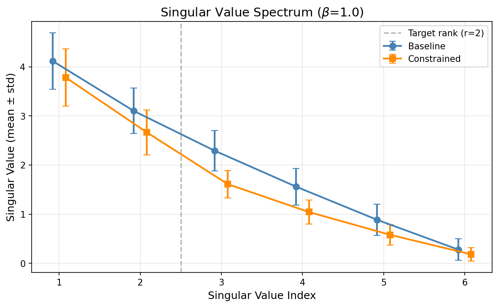

# CISE - Constraint-Induced Structure Explorer

**A computational experiment showing that simple coherence constraints induce non-trivial structure in random ensembles.**

[](LICENSE)
[](https://www.python.org/downloads/)

---

## What It Is

CISE is a neutral, reproducible framework for exploring how penalty-based constraints affect statistical ensembles. Given baseline samples from standard distributions, it applies constraints via energy-based reweighting and measures the resulting structural changes.

**Core finding**: Simple constraints (smoothness, sparsity, low-rank) induce measurable structure—dimensional concentration, hierarchical magnitude decay, and clustering—that persists even after controlling for norm shrinkage.

---

## What It Is NOT

- A physics model or simulation
- A claim about physical reality or natural phenomena
- A predictor of experimental outcomes
- An implementation of any physical theory
- A tool requiring GPU, internet, or external APIs

This is purely a **constraint experiment** for studying how penalty functions shape distributions.

---

## Quickstart

```bash
# Clone and install
git clone https://github.com/vfd-org/constraint-induced-structure
cd cise
pip install -e .

# Run the release experiment (<2 min on CPU)
python scripts/run_release.py

# Or use the CLI
python -m cise run --config configs/release.yaml --out outputs/release_run
```

**Output location**: `outputs/release_run/`

---

## What to Look At First

After running, examine these canonical figures in `outputs/release_run/figures_release/`:

### 1. ESS vs Beta


*Effective Sample Size drops as constraint strength increases, indicating measure concentration.*

### 2. Norm Distribution Shift


*Constraints favor lower-norm samples (distribution shifts left).*

### 3. PCA Explained Variance


*Constrained ensemble concentrates variance in fewer dimensions.*

### 4. PCA Scatter (2D Projection)


*Visible clustering/concentration in constrained samples.*

### 5. Singular Value Spectrum (Matrices)


*Low-rank constraint suppresses smaller singular values.*

### 6. Hierarchy Curve


*Constrained samples show steeper magnitude decay.*

---

## Key Observations

| Metric | Baseline → Constrained | Interpretation |
|--------|------------------------|----------------|
| Norm | Decreases | Constraints favor smaller magnitudes |
| Gini coefficient | Increases | Values become more unequal (sparse) |
| PCA dimensions for 90% | Decreases | Dimensional concentration |
| Rank proxy (matrices) | Decreases | Effective low-rank structure |
| ESS ratio | Decreases with β | Measure concentration |

---

## Anti-Dismissal Control

**Critique**: "Isn't this just because constraints shrink norms?"

**Control**: We construct a **norm-matched baseline**—a subset of baseline samples whose norm distribution matches the constrained distribution. If structure changes were purely from norm shrinkage, the norm-matched baseline would show identical structure.

**Result**: Structure differences persist. See `outputs/release_run/figures_control/`:

- `vector_control_pca_variance.png` — Constrained shows more concentration than norm-matched
- `vector_control_pca_scatter.png` — Different clustering patterns

The participation ratio delta and Gini delta remain non-zero after norm matching, demonstrating that constraint geometry—not just magnitude reduction—drives the structural changes.

---

## Reproducibility

- **Deterministic**: Fixed seed (1337) ensures identical outputs
- **Fast**: Release run completes in <2 minutes on CPU
- **Documented**: All parameters in `configs/release.yaml`

```bash
# Verify reproducibility
python scripts/run_release.py --out outputs/run_A
python scripts/run_release.py --out outputs/run_B
diff outputs/run_A/metrics_release.json outputs/run_B/metrics_release.json
# (Should show no differences)
```

---

## How to Extend

### Add a New Constraint (3 Steps)

1. **Create constraint file** `cise/constraints/my_constraint.py`:

```python
from cise.constraints.base import BaseConstraint, ConstraintType
import numpy as np

class MyConstraint(BaseConstraint):
    applicable_types = [ConstraintType.VECTOR]

    def __init__(self, param: float = 1.0, **kwargs):
        super().__init__(param=param, **kwargs)
        self.param = param

    def energy(self, samples: np.ndarray) -> np.ndarray:
        # Return energy per sample
        return self.param * np.sum(samples ** 2, axis=1)
```

2. **Register** in `cise/constraints/__init__.py`:

```python
from cise.constraints.my_constraint import MyConstraint
CONSTRAINTS["myconstraint"] = MyConstraint
VECTOR_CONSTRAINTS.append("myconstraint")
```

3. **Use** in config:

```yaml
constraints:
  vectors:
    - myconstraint
```

---

## Project Structure

```
cise/
├── sampling/       # Gaussian, Uniform samplers
├── constraints/    # Smoothness, L1, LowRank, Hierarchy
├── methods/        # Energy-based reweighting
├── analysis/       # Metrics, plots, controls
└── experiments/    # Runner orchestration

configs/
├── default.yaml    # Full experiment config
└── release.yaml    # Curated release config

scripts/
├── run_experiments.py  # Full run
└── run_release.py      # Curated release run

outputs/release_run/
├── figures_release/    # 6-9 canonical figures
├── figures_control/    # Anti-dismissal controls
├── metrics_release.json
└── summary_release.md
```

---

## Citation

If you use CISE in your work, please cite:

```bibtex
@software{cise2024,
  author = {Smart, Lee},
  title = {CISE: Constraint-Induced Structure Explorer},
  year = {2024},
  version = {1.0.0},
  url = {https://github.com/vfd-org/constraint-induced-structure}
}
```

See also: [CITATION.cff](CITATION.cff)

---

## License

MIT License. See [LICENSE](LICENSE).

---

## Disclaimer

**This is a constraint experiment, not a physics claim.**

CISE explores how penalty functions induce structure in statistical ensembles. Results describe distributional shifts under constraint-induced reweighting. They should not be interpreted as physical predictions or claims about any natural system.

---

## Contributing

Contributions welcome:
- Add new constraints
- Propose counterexamples
- Improve visualizations
- Extend to new sample types

Open an issue or PR at the repository.

---

## Contact

Lee Smart
Vibrational Field Dynamics Institute
Email: contact@vibrationalfielddynamics.org
X (Twitter): @vfdorg
Website: https://vibrationalfielddynamics.org

Repository: https://github.com/vfd-org/constraint-induced-structure
